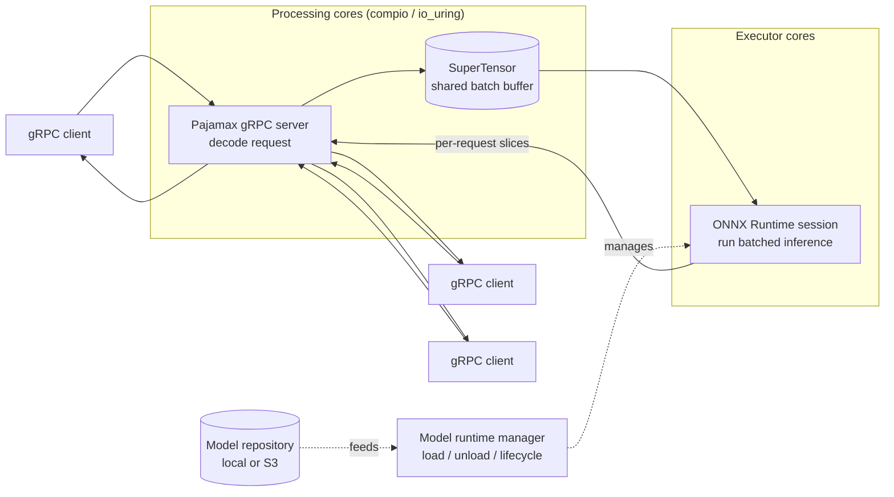

# Toutates

Toutates is an experimental inference server written in Rust. It is designed as
a near drop-in replacement for [NVIDIA Triton](https://github.com/triton-inference-server/server)
for serving small models at scale.

> **Status:** experimental. Only the ONNX Runtime backend is supported today.

## Why

Triton is a great general-purpose server, but when you are serving small models
at very high request rates, the host-side cost per request starts to dominate:
gRPC parsing, tensor copies, scheduling, and batching all add up. Toutates was
built to push that overhead as low as possible so that more of each CPU cycle
is spent on actual inference.

If your workload is **GPU-bound under Triton** (the GPU is already saturated),
Toutates will not make it faster — the bottleneck is downstream of the parts
Toutates improves. If your workload is **CPU- or host-bound** (high QPS, small
models, lots of pre/post around inference), Toutates can serve significantly
more traffic on the same hardware.

## Compatibility

Toutates speaks Triton's gRPC inference protocol (`inference.GRPCInferenceService`),
including `ModelInfer`, `ModelMetadata`, `ModelConfig`, and health checks. Existing
Triton clients work without code changes.

Model repositories follow Triton's layout, with one difference: model
configuration lives in a `config.yaml` file inside each version directory
instead of Triton's `config.pbtxt`.

```
model_repository/
  my_model/
    1/
      model.onnx
      config.yaml
```

Both local directories and S3-compatible object storage are supported as model
sources.

## Configuration

Each model version is described by a `config.yaml` next to the `model.onnx`.
This file replaces Triton's `config.pbtxt`. It is intentionally smaller — only
the fields Toutates actually uses are exposed.

### Example

```yaml
backend: supertensor
batch_size: 256
capacity: 64
num_executors: 6
allocator: cpu

# Optional — required only when the ONNX model has dynamic shapes.
input_shapes:
  pf_points:   [-1, 2, 50]
  pf_features: [-1, 20, 50]
output_shapes:
  softmax: [-1, 8]

# Optional — enables ORT profiling for this model.
profiling:
  file_prefix: ort_profile
  stop_after_batches: 1000
```

### Fields

| Field            | Type     | Required | Description                                                                                                  |
| ---------------- | -------- | -------- | ------------------------------------------------------------------------------------------------------------ |
| `backend`        | enum     | yes      | Scheduling backend. Currently only `supertensor`.                                                            |
| `batch_size`     | int      | yes      | Maximum batch size assembled before an inference call.                                                       |
| `capacity`       | int      | yes      | Number of in-flight batches the scheduler keeps queued for the model.                                        |
| `num_executors`  | int      | yes      | Number of ORT sessions running in parallel for this model.                                                   |
| `allocator`      | enum     | yes      | Memory allocator for the SuperTensor buffers: `cpu` or `cuda_pinned`.                                        |
| `input_shapes`   | map      | no       | Per-input shape override, using `-1` for the batch dimension. Required when the ONNX graph has dynamic axes. |
| `output_shapes`  | map      | no       | Per-output shape override, same convention as `input_shapes`.                                                |
| `profiling`      | object   | no       | Enables ONNX Runtime profiling. `file_prefix` defaults to `ort_profile`; `stop_after_batches` is optional.   |

## Architecture

Toutates is built around a small set of dedicated thread pools, each pinned to
its own role, and communicating through lock-free channels.



Requests from many clients are decoded on the processing cores and their
input tensors are written directly into a per-model **SuperTensor** — a shared
buffer that concatenates inputs from concurrent requests into a single batched
call. An executor core picks up the assembled batch, runs ONNX Runtime once,
and the processing cores slice the output back to each waiting caller.

### Thread-per-core

Toutates follows a thread-per-core design similar to
[Seastar](https://seastar.io/) (the framework behind
[ScyllaDB](https://www.scylladb.com/)): each processing core has its own
runtime, its own io_uring instance, and its own slice of state. There is no
shared event loop and no work-stealing between cores on the hot path —
synchronisation happens through explicit channels into the executor cores.

This keeps cache locality high and removes lock contention, but it has one
important consequence:

> **All requests on a single gRPC connection are served by the same processing
> core.** A single client connection cannot use more than one CPU. Toutates is
> designed for workloads with many concurrent connections; a single hot
> connection will saturate one core and leave the others idle.

When benchmarking with NVIDIA's `perf_analyzer`, the default gRPC client
multiplexes many concurrent requests over a small number of channels, which
under-utilises Toutates. Set:

```
TRITON_CLIENT_GRPC_CHANNEL_MAX_SHARE_COUNT=1
```

so each concurrent worker opens its own channel and the load is spread across
processing cores.

### Networking — Pajamax + compio

The gRPC server uses a [fork of Pajamax](https://github.com/geobeau/pajamax),
ported to run on [compio](https://github.com/compio-rs/compio) (io_uring).
Pajamax is a custom HTTP/2 + gRPC stack originally written by Wu Bingzheng —
see the upstream project at
[wubingzheng/pajamax](https://github.com/wubingzheng/pajamax).

The thread-per-core model described above comes from compio: each processing
core runs its own independent compio runtime with its own io_uring instance,
and tasks never migrate between runtimes. On top of that, Toutates can enable
`SQPOLL` kernel polling threads pinned to dedicated vCPUs within the same NUMA
node as the runtime they serve.

This avoids most of the overhead found in mainstream async gRPC stacks: no
thread hops per request, registered io_uring buffer pools instead of
per-request allocations, and zero global locks on the hot path.

### Batching and tensors

Incoming requests are decoded directly into a `SuperTensor` — a per-model
shared buffer that aggregates inputs from many concurrent requests into a
single batched call to ONNX Runtime. Inputs are kept in their wire order and
referenced by index rather than by name, removing hashmap and string work on
the hot path.

### Inference backend

Inference runs on ONNX Runtime via the [`ort`](https://github.com/pykeio/ort)
crate. The following execution providers have been tested:

- `cpu`
- `cuda`
- `tensorrt`

Other ONNX Runtime execution providers (ROCm, OpenVINO, etc.) have not been
tested. Multi-vendor / mixed-provider setups are not tested either — only the
single-provider configurations listed above.

Custom operator shared libraries (`.so`) can be registered via
`--custom-op-libraries`.

### CPU layout

When `--cpu-pinning` is enabled, Toutates pins each role to its own core:

- one core for the model runtime manager
- N cores for executors (`--executor-cores`)
- M cores for gRPC processing (`--processing-cores`)
- remaining cores fed to ORT's intra-op pool with explicit affinity

With `--sqpoll-enabled`, each processing core is paired with its own SQPOLL
kernel thread on a separate physical core within the same NUMA node, avoiding
SMT contention between userspace and the kernel poller.

### Observability

Prometheus metrics are exposed on port `9090` by default. Local per-thread
counters are flushed into the global registry once per second to keep the hot
path lock-free.

## Building

```
cargo build --release
```

The `release` profile is meant for benchmarks. For day-to-day development,
`cargo build` (dev profile, `opt-level = 2`) is fast enough and keeps debug
info.

## Running

Local model repository:

```
toutates \
  --model-repository ./model_repository \
  --execution-providers cuda \
  --grpc-addr 0.0.0.0:8001
```

S3 model repository:

```
toutates \
  --s3-endpoint https://s3.example.com \
  --s3-bucket my-models \
  --s3-prefix prod/ \
  --execution-providers tensorrt
```

See `--help` for the full list of flags.

## Limitations

- Experimental — APIs, flags, and on-disk formats can change.
- Only the ONNX Runtime backend is supported. PyTorch, TensorFlow, Python, and
  ensemble backends from Triton are not implemented.
- Only CPU, CUDA, and TensorRT execution providers have been tested.
  Multi-vendor / mixed-provider setups are untested.
- HTTP/REST endpoint is not implemented; only gRPC.
